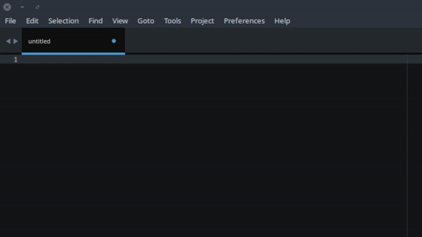
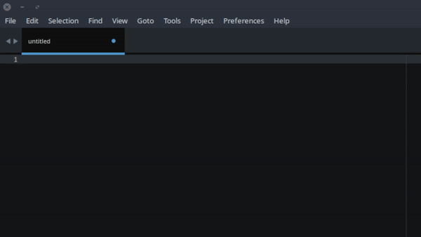

# Sequence generating plugin for Sublime Text 3 & 4

Sublime Text plugin to insert a sequence of numbers or leters into the currently active selection.

## Usage

Once installed, this plugin may be used via the Command Palette by entering "Insert Sequence" into
the Command Palette.

By default, a sequence of numbers will be inserted into the currently active selection:

If the first active selection is itself a number, the sequence will begin from that number:

If the first active selection is a letter, a sequence of letters will be inserted, also starting
from that letter:

